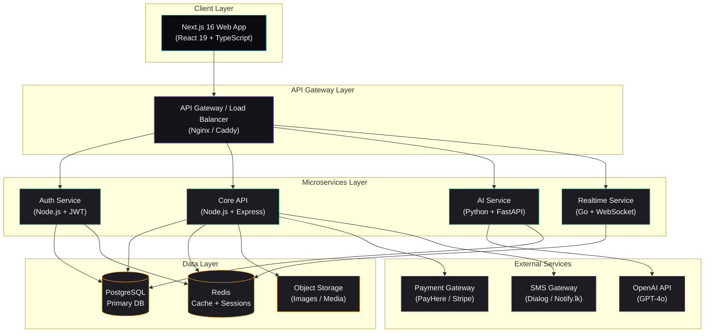
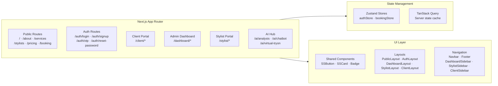
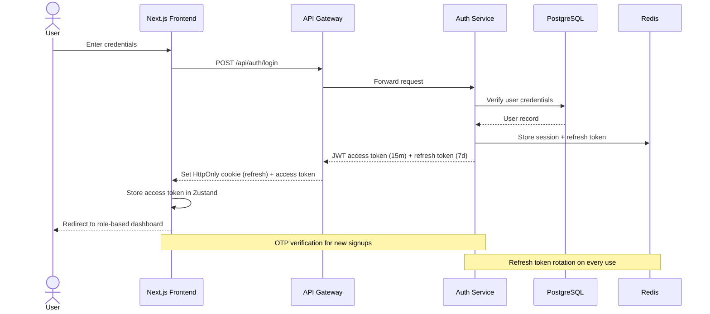
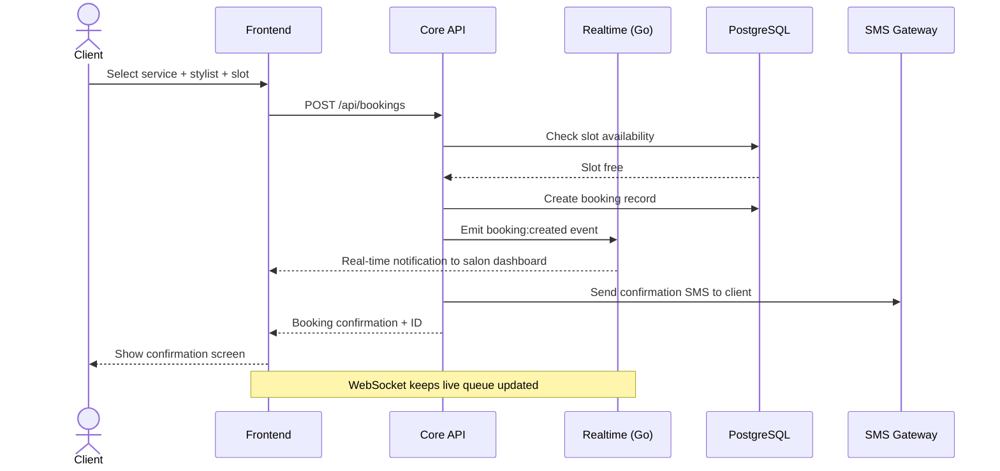
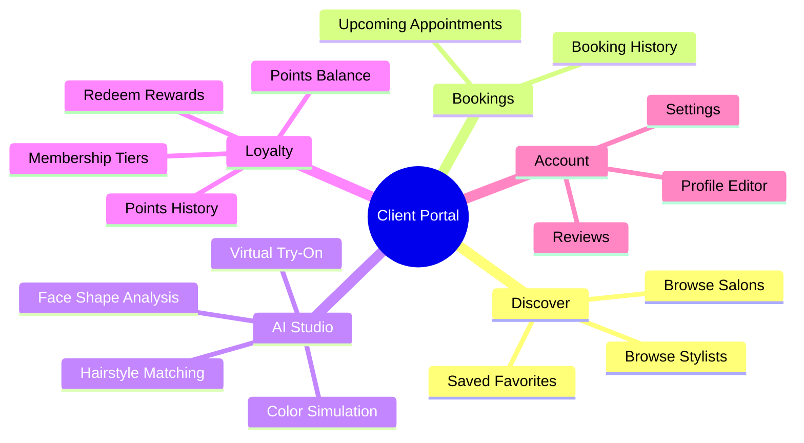
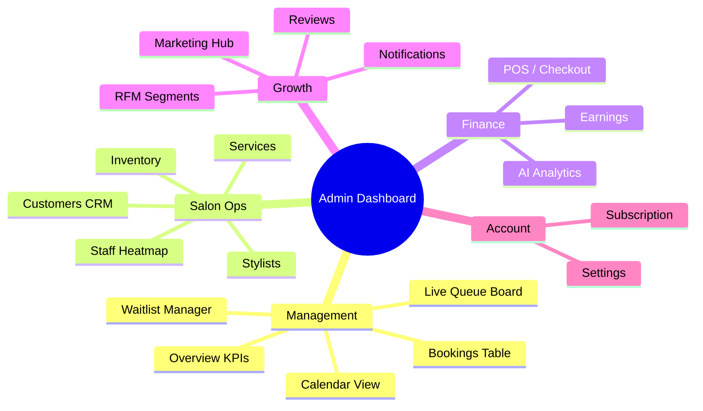
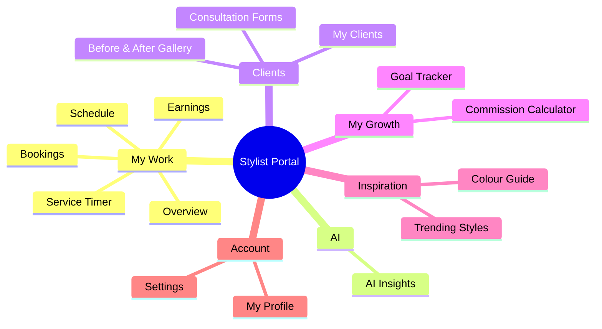
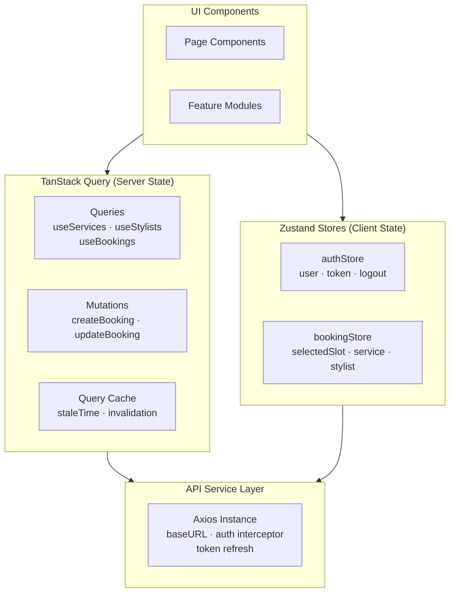
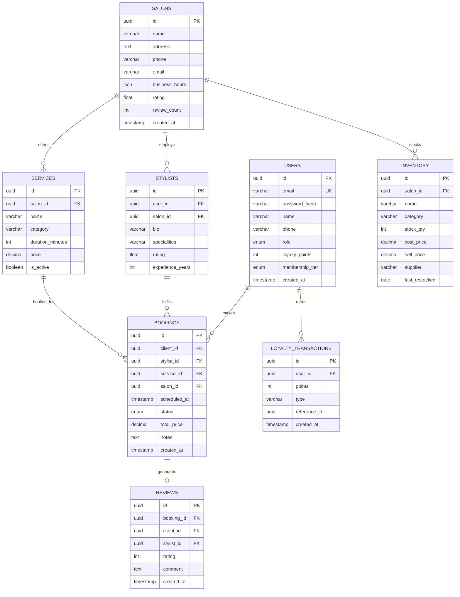
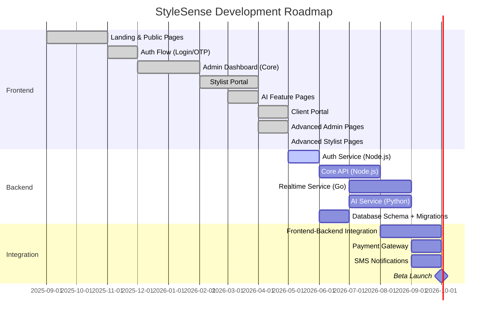

<div align="center">
  

  <h1>StyleSense</h1>
  <p><strong>The intelligent salon management platform for the modern beauty industry.</strong></p>
  <p>AI-powered bookings · Virtual try-on · Multi-role dashboards · Real-time queue · Loyalty & CRM</p>

  <br/>


  <br/>


  <br/>

[](LICENSE)


</div>

---

## Table of Contents

- [Overview](#overview)
- [Architecture](#architecture)
- [Tech Stack](#tech-stack)
- [Project Structure](#project-structure)
- [Features](#features)
  - [Public Platform](#-public-platform)
  - [Client Dashboard](#-client-dashboard)
  - [Salon Admin Dashboard](#-salon-admin-dashboard)
  - [Stylist Portal](#-stylist-portal)
  - [AI Features](#-ai-features)
- [Data Flow](#data-flow)
- [Database Schema](#database-schema)
- [API Design](#api-design)
- [Getting Started](#getting-started)
- [Environment Variables](#environment-variables)
- [Roadmap](#roadmap)
- [Contributing](#contributing)
- [License](#license)

---

## Overview

**StyleSense** is a full-stack smart salon management platform built for the modern beauty industry. It connects clients with salons through a seamless digital experience — from discovery and booking to AI-powered style recommendations and virtual try-on.

The platform is built around **three distinct user roles**:

| Role            | Portal       | Key Capabilities                                                                |
| --------------- | ------------ | ------------------------------------------------------------------------------- |
| **Client**      | `/client`    | Browse salons & stylists, book, loyalty rewards, AI hair studio, virtual try-on |
| **Salon Admin** | `/dashboard` | Full business ops — queue, POS, CRM, marketing, analytics                       |
| **Stylist**     | `/stylist`   | Schedule, clients, commissions, gallery, consultation forms                     |

> **Note:** The backend is currently under active development. All frontend pages use local mock data. This document describes the intended full-stack architecture.

---

## Architecture

### System Architecture



### Frontend Application Architecture



### Authentication Flow



### Booking Flow



---

## Tech Stack

### Frontend

| Technology                                                                                                                     | Version | Purpose                            |
| ------------------------------------------------------------------------------------------------------------------------------ | ------- | ---------------------------------- |
|  Next.js                   | 16.2.6  | App framework, SSR/SSG, App Router |
|  React                       | 19.2.4  | UI component library               |
|  TypeScript    | 5.x     | Static typing                      |
|  Tailwind CSS | v4      | Utility-first styling              |
|  Framer Motion      | 12.38   | Animations & transitions           |
| Zustand                                                                                                                        | 5.x     | Client-side global state           |
| TanStack Query                                                                                                                 | 5.x     | Server state, caching, mutations   |
| Recharts                                                                                                                       | 3.x     | Analytics charts                   |
| React Hook Form                                                                                                                | 7.x     | Form validation                    |
| Zod                                                                                                                            | 3.x     | Schema validation                  |
| Radix UI                                                                                                                       | —       | Accessible headless UI primitives  |
| Lucide React                                                                                                                   | 1.x     | Icon library                       |

### Backend _(in development)_

| Technology                                                                                                                  | Purpose                                                 |
| --------------------------------------------------------------------------------------------------------------------------- | ------------------------------------------------------- |
|  Node.js + Express   | Core REST API — bookings, users, services, payments     |
|  Go                                 | Realtime service — WebSocket, live queue, notifications |
|  Python + FastAPI       | AI service — recommendations, analysis, chatbot         |
|  PostgreSQL | Primary relational database                             |
| Redis                                                                                                                       | Session cache, rate limiting, pub/sub                   |
| JWT + Refresh Tokens                                                                                                        | Stateless authentication with rotation                  |
| Nginx                                                                                                                       | Reverse proxy + API gateway                             |

---

## Project Structure

```
stylesense/
├── frontend/                          # Next.js 16 application
│   ├── src/
│   │   ├── app/                       # App Router pages
│   │   │   ├── page.tsx               # Landing page
│   │   │   ├── about/
│   │   │   ├── services/
│   │   │   ├── stylists/
│   │   │   ├── pricing/
│   │   │   ├── booking/
│   │   │   ├── auth/                  # Login, signup, OTP, reset
│   │   │   ├── ai/                    # AI analysis, chatbot, virtual try-on
│   │   │   ├── client/                # Client portal
│   │   │   │   ├── page.tsx           # Client home overview
│   │   │   │   ├── bookings/          # Appointment history & upcoming
│   │   │   │   ├── salons/            # Browse & discover salons
│   │   │   │   ├── stylists/          # Browse & discover stylists
│   │   │   │   ├── favorites/         # Saved stylists
│   │   │   │   ├── loyalty/           # Points balance, tiers, rewards
│   │   │   │   ├── reviews/           # Submit and view reviews
│   │   │   │   ├── ai/                # AI Hair Studio + virtual try-on
│   │   │   │   ├── profile/           # Account profile editor
│   │   │   │   └── settings/          # Notification & account settings
│   │   │   ├── dashboard/             # Salon admin dashboard
│   │   │   │   ├── page.tsx           # Overview
│   │   │   │   ├── bookings/
│   │   │   │   ├── calendar/
│   │   │   │   ├── queue/             # Live queue board
│   │   │   │   ├── waitlist/          # Waitlist manager
│   │   │   │   ├── stylists/
│   │   │   │   ├── services/
│   │   │   │   ├── customers/
│   │   │   │   ├── inventory/         # Product inventory + CRUD
│   │   │   │   ├── pos/               # POS / checkout
│   │   │   │   ├── earnings/
│   │   │   │   ├── analytics/
│   │   │   │   ├── marketing/         # Campaign manager
│   │   │   │   ├── rfm/               # RFM client segmentation
│   │   │   │   ├── utilisation/       # Staff heatmap
│   │   │   │   ├── reviews/
│   │   │   │   ├── notifications/
│   │   │   │   ├── subscription/
│   │   │   │   └── settings/
│   │   │   └── stylist/               # Stylist portal
│   │   │       ├── page.tsx           # Stylist overview
│   │   │       ├── bookings/
│   │   │       ├── schedule/
│   │   │       ├── clients/
│   │   │       ├── earnings/
│   │   │       ├── ai-insights/
│   │   │       ├── trends/            # Trending styles guide
│   │   │       ├── colors/            # Colour reference
│   │   │       ├── gallery/           # Before/after gallery
│   │   │       ├── consultation/      # Client consultation forms
│   │   │       ├── goals/             # Monthly goal tracker
│   │   │       ├── timer/             # Service timer
│   │   │       ├── calculator/        # Commission calculator
│   │   │       ├── profile/
│   │   │       └── settings/
│   │   ├── components/                # Shared UI components
│   │   │   ├── animations/
│   │   │   ├── common/                # SSButton, SSCard, Badge
│   │   │   ├── layouts/               # PublicLayout, AuthLayout
│   │   │   ├── navigation/            # Navbar, Sidebar, Footer
│   │   │   └── ui/                    # Radix-based primitives
│   │   ├── features/                  # Domain feature modules
│   │   │   ├── landing/               # Hero, Features, Pricing, CTA
│   │   │   ├── authentication/        # LoginForm, SignupForm
│   │   │   ├── booking/
│   │   │   ├── dashboard/
│   │   │   ├── ai-analysis/
│   │   │   ├── ai-recommendation/
│   │   │   ├── chatbot/
│   │   │   ├── virtual-tryon/
│   │   │   ├── services/
│   │   │   ├── stylists/
│   │   │   ├── analytics/
│   │   │   ├── loyalty/
│   │   │   ├── payments/
│   │   │   ├── reviews/
│   │   │   └── notifications/
│   │   ├── hooks/                     # useAuth, useBooking, useServices, useStylists
│   │   ├── services/                  # API client + domain services
│   │   │   ├── api/client.ts          # Axios instance
│   │   │   ├── auth/
│   │   │   ├── booking/
│   │   │   ├── stylists/
│   │   │   ├── services/
│   │   │   ├── payments/
│   │   │   └── ai/
│   │   ├── store/                     # Zustand stores
│   │   │   ├── authStore.ts
│   │   │   └── bookingStore.ts
│   │   ├── types/                     # TypeScript interfaces
│   │   └── schemas/                   # Zod validation schemas
│   ├── public/
│   │   └── stylesense_logo.png
│   ├── next.config.ts
│   ├── tailwind.config.ts
│   └── package.json
│
└── backend/                           # ⚙️ In development
    ├── auth-service/                  # Node.js — JWT auth, OTP
    ├── core-api/                      # Node.js — bookings, users, services
    ├── ai-service/                    # Python — recommendations, chatbot
    ├── realtime-service/              # Go — WebSocket, live queue
    └── gateway/                       # Nginx config
```

---

## Features

### 🌐 Public Platform

The consumer-facing side of StyleSense for clients discovering and booking salon services.

| Page           | Route            | Description                                              |
| -------------- | ---------------- | -------------------------------------------------------- |
| Landing        | `/`              | Hero, features, services showcase, testimonials, pricing |
| About          | `/about`         | Brand story and mission                                  |
| Services       | `/services`      | Full service catalogue with pricing                      |
| Service Detail | `/services/[id]` | Individual service page                                  |
| Stylists       | `/stylists`      | Stylist profiles and ratings                             |
| Pricing        | `/pricing`       | Membership tier comparison                               |
| Booking        | `/booking`       | Multi-step appointment booking flow                      |

**Membership Tiers:**


---

### 👤 Client Dashboard

Personal portal for clients at `/client`, with its own sidebar navigation and glassmorphism card design.



| Section            | Route               | Key Features                                                           |
| ------------------ | ------------------- | ---------------------------------------------------------------------- |
| **Home**           | `/client`           | Welcome overview, upcoming bookings, quick stats, AI feature shortcuts |
| **Salons**         | `/client/salons`    | Browse and discover nearby salons, ratings, services                   |
| **Stylists**       | `/client/stylists`  | Discover stylists, filter by specialty and rating                      |
| **Bookings**       | `/client/bookings`  | Upcoming and past appointment history, status tracking                 |
| **Favorites**      | `/client/favorites` | Saved stylists for quick re-booking                                    |
| **Loyalty**        | `/client/loyalty`   | Points balance, tier progress, reward redemption, transaction history  |
| **Reviews**        | `/client/reviews`   | Submit and manage salon/stylist reviews                                |
| **AI Hair Studio** | `/client/ai`        | Gender-based face shape analysis, hairstyle matching, color simulation |
| **Profile**        | `/client/profile`   | Edit personal info, preferred styles                                   |
| **Settings**       | `/client/settings`  | Notification preferences, privacy, account management                  |

---

### 🏢 Salon Admin Dashboard

Full business management for salon owners and managers at `/dashboard`.



| Section            | Route                      | Key Features                                      |
| ------------------ | -------------------------- | ------------------------------------------------- |
| **Overview**       | `/dashboard`               | KPI cards, revenue chart, upcoming bookings       |
| **Bookings**       | `/dashboard/bookings`      | Full booking management, status updates           |
| **Calendar**       | `/dashboard/calendar`      | Weekly/monthly appointment calendar               |
| **Live Queue**     | `/dashboard/queue`         | Real-time in-service / waiting / completed board  |
| **Waitlist**       | `/dashboard/waitlist`      | Waitlist entries, one-click notify & book         |
| **Stylists**       | `/dashboard/stylists`      | Stylist profiles, performance metrics             |
| **Services**       | `/dashboard/services`      | Service CRUD, pricing, duration                   |
| **Customers**      | `/dashboard/customers`     | Client database, visit history                    |
| **Inventory**      | `/dashboard/inventory`     | Product stock, low-stock alerts, CRUD             |
| **Staff Heatmap**  | `/dashboard/utilisation`   | Weekly time × stylist utilisation grid            |
| **POS / Checkout** | `/dashboard/pos`           | Quick-add services + products, receipt            |
| **Earnings**       | `/dashboard/earnings`      | Revenue breakdown, commission reports             |
| **Analytics**      | `/dashboard/analytics`     | AI-powered business insights                      |
| **Marketing Hub**  | `/dashboard/marketing`     | SMS/email campaigns, auto-campaigns               |
| **RFM Segments**   | `/dashboard/rfm`           | Client segmentation (Champions / At Risk / Lost…) |
| **Reviews**        | `/dashboard/reviews`       | Review management                                 |
| **Notifications**  | `/dashboard/notifications` | System notifications                              |
| **Subscription**   | `/dashboard/subscription`  | Salon plan management                             |
| **Settings**       | `/dashboard/settings`      | Business profile, hours, preferences              |

---

### 💇 Stylist Portal

Dedicated workspace for stylists at `/stylist`.



| Section                    | Route                   | Key Features                                        |
| -------------------------- | ----------------------- | --------------------------------------------------- |
| **Overview**               | `/stylist`              | Upcoming bookings, earnings summary, quick stats    |
| **Bookings**               | `/stylist/bookings`     | Personal booking list and status                    |
| **Schedule**               | `/stylist/schedule`     | Weekly availability and appointments                |
| **Earnings**               | `/stylist/earnings`     | Commission breakdown (70/30 split)                  |
| **Service Timer**          | `/stylist/timer`        | Stopwatch / countdown timer with session log        |
| **AI Insights**            | `/stylist/ai-insights`  | Personalised performance insights                   |
| **My Clients**             | `/stylist/clients`      | Client history per stylist                          |
| **Consultation Forms**     | `/stylist/consultation` | Digital 4-step client intake forms                  |
| **Before / After Gallery** | `/stylist/gallery`      | Transformation portfolio with public/private toggle |
| **Goal Tracker**           | `/stylist/goals`        | Monthly targets — sessions, earnings, rating        |
| **Commission Calc**        | `/stylist/calculator`   | Live commission breakdown + monthly projection      |
| **Trending Styles**        | `/stylist/trends`       | 2025 trend guide — cuts, colours, techniques        |
| **Colour Guide**           | `/stylist/colors`       | Colour reference and formulas                       |
| **Profile**                | `/stylist/profile`      | Public stylist profile editor                       |
| **Settings**               | `/stylist/settings`     | Account preferences                                 |

---

### 🤖 AI Features

| Feature               | Route               | Description                                                          |
| --------------------- | ------------------- | -------------------------------------------------------------------- |
| **AI Style Analysis** | `/ai/analysis`      | Upload photo → AI analyses hair type, condition, recommends services |
| **AI Chatbot**        | `/ai/chatbot`       | Conversational assistant for style questions and booking help        |
| **Virtual Try-On**    | `/ai/virtual-tryon` | Preview hairstyles and colours virtually before booking              |

---

## Data Flow

### State Management Architecture



---

## Database Schema

> ⚠️ Backend in development — schema is the planned design.



---

## API Design

> ⚠️ Backend in development — API contracts are the planned design.

### Core Endpoints

```
Auth Service (Node.js)
POST   /api/auth/register          Register new user
POST   /api/auth/login             Login + issue tokens
POST   /api/auth/logout            Invalidate refresh token
POST   /api/auth/refresh           Rotate refresh token
POST   /api/auth/otp/send          Send OTP via SMS
POST   /api/auth/otp/verify        Verify OTP

Core API (Node.js)
GET    /api/salons                 List salons
GET    /api/salons/:id             Salon detail
GET    /api/services               List services
GET    /api/services/:id           Service detail
GET    /api/stylists               List stylists
GET    /api/stylists/:id           Stylist detail

POST   /api/bookings               Create booking
GET    /api/bookings/:id           Get booking
PATCH  /api/bookings/:id/status    Update booking status
DELETE /api/bookings/:id           Cancel booking

GET    /api/dashboard/overview     Admin KPI metrics
GET    /api/dashboard/queue        Live queue state
POST   /api/dashboard/queue        Add walk-in to queue
PATCH  /api/dashboard/queue/:id    Update queue entry status

GET    /api/inventory              List inventory items
POST   /api/inventory              Add product
PATCH  /api/inventory/:id          Update product
DELETE /api/inventory/:id          Remove product

POST   /api/payments/initiate      Initiate payment
POST   /api/payments/webhook       Payment gateway webhook

AI Service (Python / FastAPI)
POST   /api/ai/analyse             Analyse hair from image
POST   /api/ai/recommend           Get style recommendations
POST   /api/ai/chat                Chatbot conversation
POST   /api/ai/virtual-tryon       Virtual hairstyle preview

Realtime Service (Go / WebSocket)
WS     /ws/queue                   Live queue updates
WS     /ws/notifications           Real-time notifications
```

---

## Getting Started

### Prerequisites

- Node.js ≥ 20
- npm ≥ 10
- Git

### Frontend Setup

```bash
# 1. Clone the repository
git clone https://github.com/your-org/stylesense.git
cd stylesense

# 2. Install frontend dependencies
cd frontend
npm install

# 3. Set up environment variables
cp .env.example .env.local
# Edit .env.local with your values

# 4. Run the development server
npm run dev
```

Open [http://localhost:3000](http://localhost:3000) in your browser.

### Available Scripts

```bash
npm run dev        # Start development server (Next.js + Turbopack)
npm run build      # Production build
npm run start      # Start production server
npm run lint       # Run ESLint
```

> **Backend services** are not yet available. The frontend runs entirely on mock data during development.

---

## Environment Variables

Create a `.env.local` file in the `frontend/` directory:

```env
# API
NEXT_PUBLIC_API_URL=http://localhost:8000/api
NEXT_PUBLIC_WS_URL=ws://localhost:8001

# AI Service
NEXT_PUBLIC_AI_API_URL=http://localhost:8002/api

# App
NEXT_PUBLIC_APP_URL=http://localhost:3000
NEXT_PUBLIC_APP_NAME=StyleSense
```

---

## Roadmap



### Planned Features

- [ ] Backend microservices (Auth · Core · AI · Realtime)
- [ ] PostgreSQL schema + migrations
- [ ] Real payment integration (PayHere / Stripe)
- [ ] SMS notifications via Notify.lk / Dialog
- [ ] Mobile app (React Native)
- [ ] Multi-salon support
- [ ] Franchise management
- [ ] WhatsApp booking bot

---

## Contributing

Contributions are welcome! Please follow these steps:

1. Fork the repository
2. Create a feature branch: `git checkout -b feature/your-feature-name`
3. Commit your changes: `git commit -m "feat: add your feature"`
4. Push to the branch: `git push origin feature/your-feature-name`
5. Open a Pull Request

Please follow [Conventional Commits](https://www.conventionalcommits.org/) for commit messages.

---

## License

This project is licensed under the **MIT License** — see the [LICENSE](LICENSE) file for details.

---

<div align="center">
  
  <br/>
  <sub>Built with ❤️ for the beauty industry · Sri Lanka 🇱🇰</sub>
  <br/><br/>
  <sub>
    <a href="https://nextjs.org">Next.js</a> ·
    <a href="https://nodejs.org">Node.js</a> ·
    <a href="https://go.dev">Go</a> ·
    <a href="https://fastapi.tiangolo.com">FastAPI</a> ·
    <a href="https://postgresql.org">PostgreSQL</a>
  </sub>
</div>
